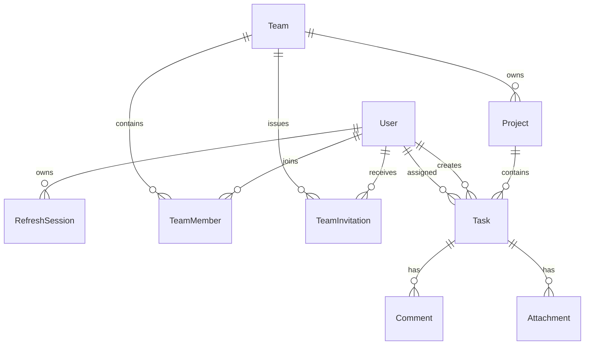

# TaskMaster Backend

A production-oriented REST API for team-based task tracking. TaskMaster supports secure accounts,
teams and invitations, projects, task assignment and discovery, comments, and private file
attachments.

## Technology

- Node.js 24 LTS, TypeScript, Express 5
- PostgreSQL 17 and Prisma ORM/Migrate
- Argon2id password hashing and rotating refresh sessions
- Zod request validation and OpenAPI 3.1 documentation
- Vitest, Supertest, ESLint, Prettier, Docker, and GitHub Actions

## Architecture

The code is organized by feature under `src/modules`. Routes validate their input before invoking
domain logic, authorization helpers enforce team boundaries, and Prisma owns persistence. Shared
HTTP, authentication, serialization, logging, and error behavior live under `src/shared`.



Team roles are `OWNER`, `ADMIN`, and `MEMBER`. Owners and administrators manage team resources;
members can create tasks, assign current team members, comment, upload files, and manage their own
content. A task assignee may update its status, while the task creator and team managers may update
all task fields.

## Quick start with Docker

Requirements: Docker Engine with Docker Compose.

```bash
git clone https://github.com/praveen202105/taskmaster-backend.git
cd taskmaster-backend
docker compose up --build
```

The API is available at `http://localhost:3000`, Swagger UI at
`http://localhost:3000/docs`, and the OpenAPI document at
`http://localhost:3000/openapi.json`.

Compose creates durable volumes for PostgreSQL and attachments, waits for the database, applies
committed migrations, and then starts the API.

## Manual development setup

Requirements: Node.js 24, npm 11, and PostgreSQL 17.

```bash
nvm use
cp .env.example .env
npm ci
npm run db:migrate
npm run db:seed
npm run dev
```

The local seed creates `owner@taskmaster.local` and `member@taskmaster.local` using
`SEED_PASSWORD`. Never use the example credentials or secrets in a deployed environment.

## Configuration

| Variable                        | Purpose                                                  |
| ------------------------------- | -------------------------------------------------------- |
| `NODE_ENV`                      | `development`, `test`, or `production`                   |
| `PORT`                          | HTTP port; defaults to `3000`                            |
| `DATABASE_URL`                  | PostgreSQL connection URL                                |
| `JWT_ACCESS_SECRET`             | At least 32 random characters used to sign access tokens |
| `ACCESS_TOKEN_TTL`              | Access-token lifetime, such as `15m`                     |
| `REFRESH_TOKEN_TTL_DAYS`        | Rotating refresh-session lifetime                        |
| `CORS_ORIGINS`                  | Comma-separated browser origin allowlist                 |
| `TRUST_PROXY`                   | Number of trusted reverse proxies                        |
| `UPLOAD_DIR`                    | Private persistent attachment directory                  |
| `MAX_ATTACHMENT_BYTES`          | Per-file limit; defaults to 10 MiB                       |
| `ALLOWED_ATTACHMENT_MIME_TYPES` | Comma-separated MIME allowlist                           |
| `RATE_LIMIT_*`                  | API and authentication throttling controls               |
| `LOG_LEVEL`                     | Pino log level                                           |

Generate production secrets with a cryptographically secure tool:

```bash
openssl rand -base64 48
```

## API overview

All application routes use the `/api/v1` prefix. JSON resources return `{ "data": ... }`.
Paginated collections add a `meta` object. Errors use:

```json
{
  "error": {
    "code": "VALIDATION_ERROR",
    "message": "Request validation failed",
    "details": [{ "field": "body.email", "message": "Invalid email address" }],
    "requestId": "d7988d49-c1e2-43e7-841a-4de889e82767"
  }
}
```

| Area           | Endpoints                                                             |
| -------------- | --------------------------------------------------------------------- |
| Health         | `GET /health/live`, `GET /health/ready`                               |
| Authentication | `POST /auth/register`, `/auth/login`, `/auth/refresh`, `/auth/logout` |
| Profile        | `GET/PATCH /users/me`, `PATCH /users/me/password`                     |
| Teams          | Team CRUD, member listing/removal, nested invitations                 |
| Invitations    | List, accept, or decline the current user's invitations               |
| Projects       | Team project listing/creation and project read/update/delete          |
| Tasks          | Project task creation and global task read/update/delete/listing      |
| Comments       | Task comment listing/creation and comment update/delete               |
| Attachments    | Task upload/listing and authenticated download/delete                 |

The complete request and response contract is available in Swagger UI.

### Authentication example

Register or log in to receive a short-lived bearer token. The rotating refresh token is stored in an
HTTP-only cookie.

```bash
curl -i -c cookies.txt -X POST http://localhost:3000/api/v1/auth/register \
  -H 'Content-Type: application/json' \
  -d '{
    "name": "Ada Lovelace",
    "email": "ada@example.com",
    "password": "a-long-and-unique-passphrase"
  }'
```

Use the returned access token for protected routes:

```bash
curl 'http://localhost:3000/api/v1/tasks?assignee=me&status=OPEN' \
  -H 'Authorization: Bearer ACCESS_TOKEN'
```

Task listing accepts `projectId`, `status`, `priority`, `assignee=me`, `q`, `sortBy`, `order`,
`page`, and `limit`. Search is case-insensitive across task title and description.

### Attachment behavior

Upload one multipart field named `file`:

```bash
curl -X POST http://localhost:3000/api/v1/tasks/TASK_ID/attachments \
  -H 'Authorization: Bearer ACCESS_TOKEN' \
  -F 'file=@evidence.pdf;type=application/pdf'
```

Files are content-inspected, assigned randomized storage keys, kept outside the public web root, and
downloaded only after team authorization. The storage key is never returned by the API.

## Database lifecycle

Create migrations during development and commit the generated SQL:

```bash
npm run db:migrate
```

Apply committed migrations in testing, staging, and production:

```bash
npm run db:migrate:deploy
```

Do not use `prisma db push` against a production database.

## Quality checks

```bash
npm run format:check
npm run lint
npm run typecheck
npm run test:coverage
npm run build
npm audit --omit=dev --audit-level=high
```

Integration tests require PostgreSQL. GitHub Actions provisions PostgreSQL 17, applies migrations,
runs the full coverage suite, and builds the production container.

## Production notes

- Terminate TLS at a trusted reverse proxy and set `TRUST_PROXY` correctly.
- Store signing secrets and database credentials in a secret manager.
- Run `prisma migrate deploy` as a release step before switching application traffic.
- Persist and back up both PostgreSQL and `UPLOAD_DIR`.
- The local filesystem attachment provider requires one API replica or a shared durable volume.
  Horizontal multi-replica deployments should implement the existing `FileStorage` interface with
  object storage before scaling out.
- Monitor readiness failures, HTTP 5xx logs, authentication throttling, disk capacity, and orphaned
  file cleanup warnings.
